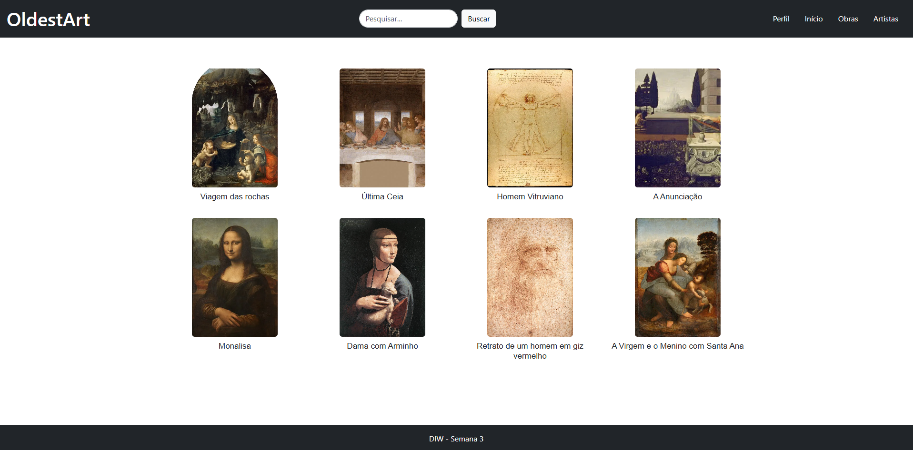
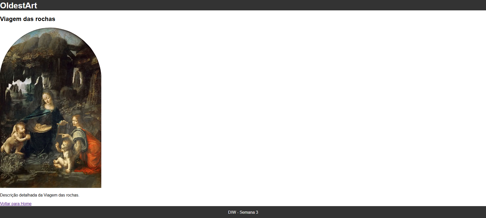

[](https://classroom.github.com/online_ide?assignment_repo_id=20901635&assignment_repo_type=AssignmentRepo)
# Trabalho Prático 05 - Semanas 7 e 8

**Páginas de detalhes dinâmicas**

Nessa etapa, vamos evoluir o trabalho anterior, acrescentando a página de detalhes, conforme o  projeto escolhido. Imagine que a página principal (home-page) mostre um visão dos vários itens que existem no seu site. Ao clicar em um item, você é direcionado pra a página de detalhes. A página de detalhe vai mostrar todas as informações sobre o item do seu projeto. seja esse item uma notícia, filme, receita, lugar turístico ou evento.

Leia o enunciado completo no Canvas. 

**IMPORTANTE:** Assim como informado anteriormente, capriche na etapa pois você vai precisar dessa parte para as próximas semanas. 

**IMPORTANTE:** Você deve trabalhar e alterar apenas arquivos dentro da pasta **`public`,** mantendo os arquivos **`index.html`**, **`styles.css`** e **`app.js`** com estes nomes, conforme enunciado. Deixe todos os demais arquivos e pastas desse repositório inalterados. **PRESTE MUITA ATENÇÃO NISSO.**

## Informações Gerais

- Nome: Matheus Iaze Mazzoni
- Matricula: 00900363
- Proposta de projeto escolhida: Exposição artistica
- Breve descrição sobre seu projeto: Um site com o intuito de fazer uma exposição de obras de arte e suas informações, para apreciação e estudo das mesmas.

## Print da Home-Page



## Print da página de detalhes do item



## Cole aqui abaixo a estrutura JSON utilizada no app.js

```javascript
const obras = [
    {
        id: "viagem-das-rochas",
        titulo: "Viagem das rochas",
        imagem: "imagens/viagemdasrochas.jpg",
        descricao: "Descrição detalhada da Viagem das rochas."
    },
    {
        id: "ultima-ceia",
        titulo: "Última Ceia",
        imagem: "imagens/santa.jpg",
        descricao: "Descrição detalhada da Última Ceia."
    },
    {
        id: "homem-vitruviano",
        titulo: "Homem Vitruviano",
        imagem: "imagens/homem vitruviano.webp",
        descricao: "Descrição detalhada do Homem Vitruviano."
    },
    {
        id: "anunciacao",
        titulo: "A Anunciação",
        imagem: "imagens/anunciacao.jpg",
        descricao: "Descrição detalhada da Anunciação."
    },
    {
        id: "monalisa",
        titulo: "Monalisa",
        imagem: "imagens/mona.jpg",
        descricao: "Descrição detalhada da Monalisa."
    },
    {
        id: "dama-com-arminho",
        titulo: "Dama com Arminho",
        imagem: "imagens/Dama com Arminho.jpg",
        descricao: "Descrição detalhada da Dama com Arminho."
    },
    {
        id: "giz-vermelho",
        titulo: "Retrato de um homem em giz vermelho",
        imagem: "imagens/Retrato de um homem em giz vermelho.jpg",
        descricao: "Descrição detalhada do Retrato de um homem em giz vermelho."
    },
    {
        id: "virgem-e-menino",
        titulo: "A Virgem e o Menino com Santa Ana",
        imagem: "imagens/A Virgem e o Menino com Santa Ana.jpg",
        descricao: "Descrição detalhada da Virgem e o Menino com Santa Ana."
    }
]
```